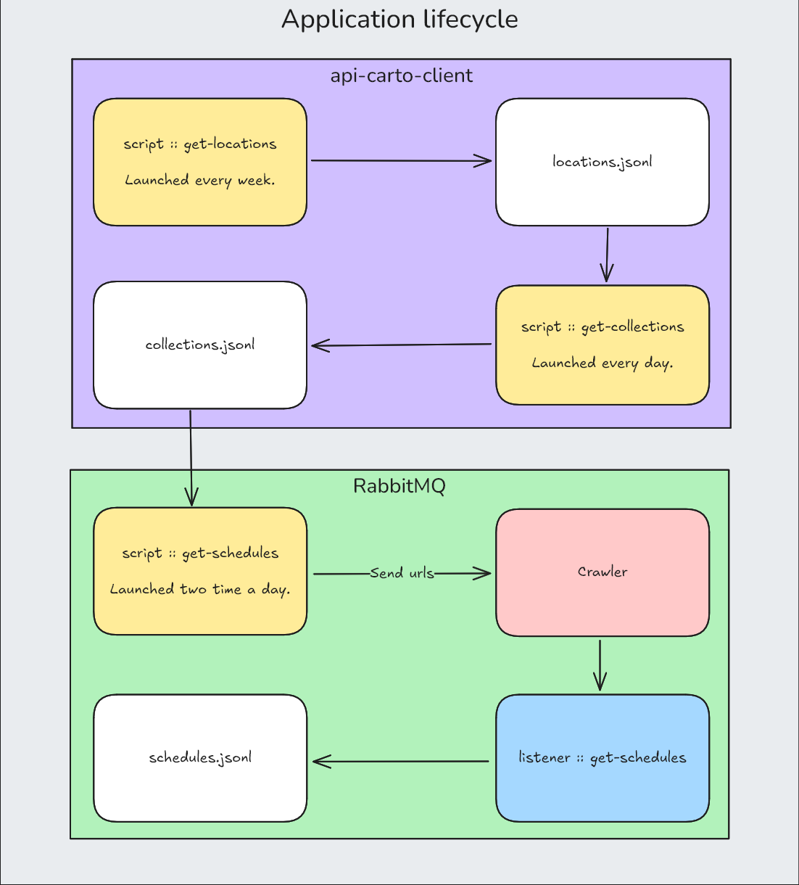

# Collectes EFS

A comprehensive data collection and analysis system for the French Blood Service (EFS) API. This project retrieves, processes, and stores EFS collection data to provide insights into blood donation schedules and locations across Brittany.

## 🚀 Quick Start

### Prerequisites
- Docker and Docker Compose
- Git

### Installation & Setup

1. **Clone the repository**
   ```bash
   git clone <repository-url>
   cd collectes-efs
   ```

2. **Build all services**
   ```bash
   docker compose build
   ```

3. **Start the infrastructure**
   ```bash
   docker compose up -d rabbitmq 
   docker compose up -d crawler
   docker compose up -d consumer
   ```

4. **Run data collection**
   ```bash
   # Collect all locations (run weekly)
   docker compose run --rm get-locations
   
   # Collect collections data (run daily)
   docker compose run --rm get-collections
   
   # Collect schedules (run twice daily)
   docker compose run --rm get-schedules
   ```

5. **Setup automated scheduling** *(optional)*
   ```bash
    # 1. Copy the script
    sudo cp run-collectes.sh /usr/local/bin/
    sudo chmod +x /usr/local/bin/run-collectes.sh

    # 2. Update the path in the script
    sudo nano /usr/local/bin/run-collectes.sh
    # Change PROJECT_DIR="/path/to/your/collectes-efs"

    # 3. Test the script
    /usr/local/bin/run-collectes.sh schedules

    # 4. Add to crontab
    crontab -e
    # Copy the lines from crontab-collectes file
   ```

## 📊 What This Project Does

The system automatically:
- 🗺️ **Discovers** blood donation locations across Brittany
- 📅 **Retrieves** collection schedules and availability
- 🕷️ **Crawls** detailed appointment data from EFS websites  
- 💾 **Stores** everything in structured JSONL format
- ⏰ **Schedules** regular updates to keep data fresh

## 🏗️ Architecture


<div align="center">
  
</div>

### Core Components

#### 🔌 **api-carto-client**
Auto-generated Python client for the EFS API, providing type-safe access to:
- Regional location data
- Collection group information  
- Sampling location details

#### 🕷️ **crawler**
Intelligent web scraper that processes collection URLs and extracts detailed schedule information.

**Key Features:**
- Headless browser automation (Firefox/Chromium)
- RabbitMQ integration for scalable processing
- Configurable request throttling
- Persistent session management

**Arguments:**
- `--urls` - List of URLs to crawl
- `--headless` - Run browser in headless mode
- `--browser-type` - Browser type to use (firefox/chromium)
- `--keep-alive` - Keep crawler running indefinitely (consuming urls from RabbitMQ queue)
- `--request-handled-timeout` - Timeout for request handling in seconds
- `--system-info-interval` - (**Doesn't work yet**) Interval for system info logging in seconds

**Usage:**
```bash
# One-time crawl
docker compose run --rm crawler main.py --urls "https://efs.link/example" --headless

# Start as persistent service
docker compose up -d crawler --keep-alive
```

#### 📊 **collect-info**
Collection of specialized data gathering scripts.

## 📋 Data Collection Scripts

### 🏥 `get_lieux_collecte.py`
**Purpose:** Discovers and maps all blood donation locations in Brittany

**Schedule:** Weekly (Sundays at 2 AM)

**Arguments:**
- `--force` - Bypass cache and refresh all location data

**Output Files:**
- `data/groups.jsonl` - Location groups/clusters
- `data/locations.jsonl` - Individual donation sites

**Sample Location:**
```json
{
  "city": "PLOUZANE",
  "fullAddress": "PARVIS BLAISE PASCAL 29280 PLOUZANE",
  "name": "E.N.I.B.",
  "postCode": "29280",
  "giveBlood": 1,
  "givePlasma": 0,
  "latitude": 48.4025,
  "longitude": -4.4744,
  "samplingLocationCode": "12345"
  ...
}
```

### 🩸 `get_collectes.py`
**Purpose:** Retrieves scheduled blood collection events from the EFS API

**Schedule:** Daily (3 AM)

**Output:** `data/collections.json`

**Sample Collection:**
```json
{
  "date": "2025-10-07T00:00:00",
  "groupCode": "F50261",
  "morningStartTime": "08:40:00",
  "morningEndTime": "13:00:00",
  "isPublic": true,
  "availableSlots": 45,
  "city": "PLOUZANE",
  "address": "PARVIS BLAISE PASCAL"
  ...
}
```

### 📅 `get_schedules.py`
**Purpose:** Extracts detailed appointment availability by crawling EFS booking pages

**Schedule:** Twice daily (6 AM & 6 PM)

**Modes:**
- **Producer mode** (default): Sends URLs to crawler via RabbitMQ
- **Consumer mode** (`--listen`): Processes crawler results

**Arguments:**
- `--listen` - Run in consumer mode to process crawler data

**Output:** `data/schedules.jsonl`

**Sample Schedule:**
```json
{
  "url": "https://efs.link/S92Ti",
  "time": "2025-08-03T21:14:19.471679Z", # Date of crawling
  "events": [
    {
      "date": "09/09/2025",
      "type": "blood",
      "totalSlots": 176,
      "availableSlots": 23,
      "schedules": {
        "09h00": 1,
        "09h15": 2,
        "10h30": 0,
        ...
        "17h45": 2
      }
    },
    ...
  ]
}
```

## ⏰ Automated Scheduling (optional)

You can use `run-collectes.sh` and `crontab-collectes` to schedule automated data collection.

### Default scheduled Tasks
| Task | Frequency | Purpose |
|------|-----------|---------|
| `get-locations` | Weekly (Sun 2 AM) | Update location database |
| `get-collections` | Daily (3 AM) | Refresh collection events |
| `get-schedules` | Twice daily (6 AM, 6 PM) | Update appointment availability |

## 🛠️ Development

### Manual Data Collection

```bash
# Force refresh all location data
docker compose run --rm get-locations --force

# Update collections for today
docker compose run --rm get-collections

# Crawl schedules with consumer listening
docker compose run -d get-schedules --listen  # Start consumer
docker compose run --rm get-schedules         # Send crawl jobs
```

### Monitoring

```bash
# View logs
docker compose logs -f crawler
docker compose logs -f consumer

# Check RabbitMQ status
open http://localhost:15672  # guest/guest
```

### Data Location

All collected data is stored in the `./collecte-info/data/` directory:
- `groups.jsonl` - Location groups
- `locations.jsonl` - Individual sites  
- `collections.json` - Scheduled events
- `schedules.jsonl` - Detailed availability
