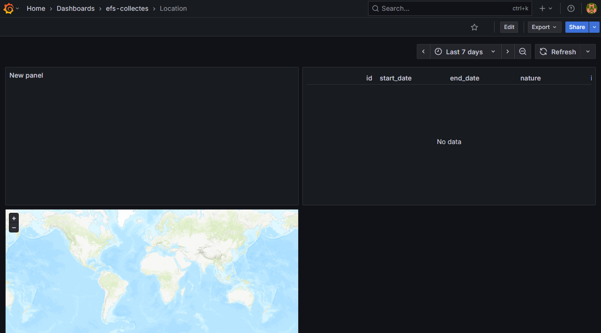

# Manage Grafana Dashboards and Panels

## Basic knowledge
- In Grafana, everything is **JSON**.
- While there is a feature to sync Grafana dashboards, data sources, and more, directly with a GitHub repo, it (GitSync plugin) is still in heavy testing and not yet fully integrated.
	- That's why we are versioning dashboards manually for now.

## Project structure
In this repo all Dashboards files are located in the folder `/grafana/dashboards/` and use following syntax: `<FolderName>/<DashboardName>.json`

## 📋 Exporting a dashboard as JSON
To export a dashboard from Grafana into **JSON** file it's simple:
1. Go to the dashboard you want to export
2. Make sure you are not in editor mode
3. You should see an Export button in the top right corner
4. Make sure to check **Export the dashboard to use in another instance** so it does mock data sources
5. Copy the content, and Voilà ! 😊

## 📥 Importing existing dashboard from JSON

1. Go to the **Dashboard** section of Grafana (and folder if you have one).
2. Click on `New` -> `Import`
3.  Add your JSON file (or C/C)
4. Don't forget to select the right **data source** ⚠️
5. 💪 Good job, your dashboard should be all set !

### 🚨 Uh oh... It doesn't work !

**If the panels in the dashboard are not working correctly**
- Make sure that the dashboard doesn't require **variables**
	- This dashboard require the variable **$location_id**  but it is not set: `&var-location_id=`. Just add a valid value and see if it works.
- If the problem persist, edit panels and run queries to refresh the data, it should do the trick 😉
